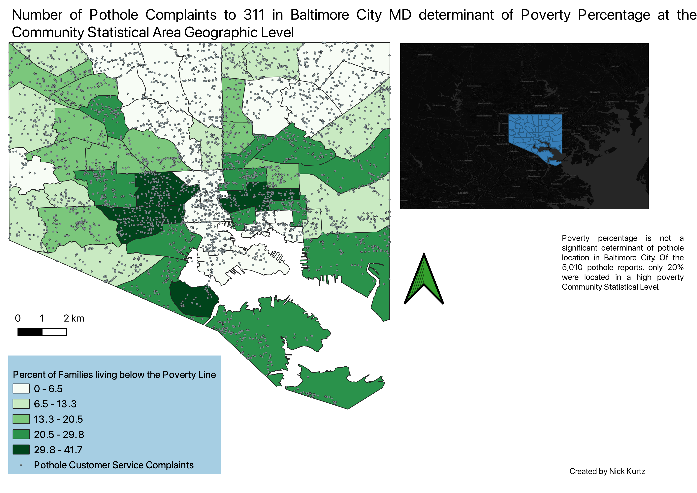

## Portfolio

---

### Geographic Information Systems Projects

[MTA Bus Stop and Tree Cover Analaysis](/final_proj_page)

[Denver Metro Area Income Fluctuation](/project1_page)

---
[MDOT SHA Green House Gas Analysis](/project2_page)

---
[Poverty Percentage as Determinant of Pothole Incidence](/project3_page)

---

---

---
<!-- Remove above link if you don't want to attibute -->
