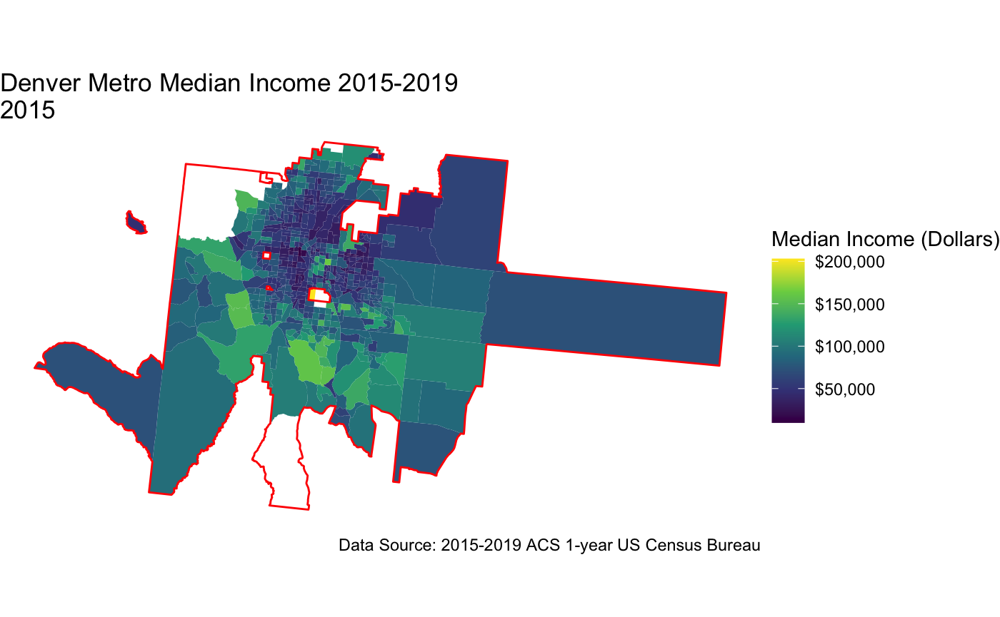
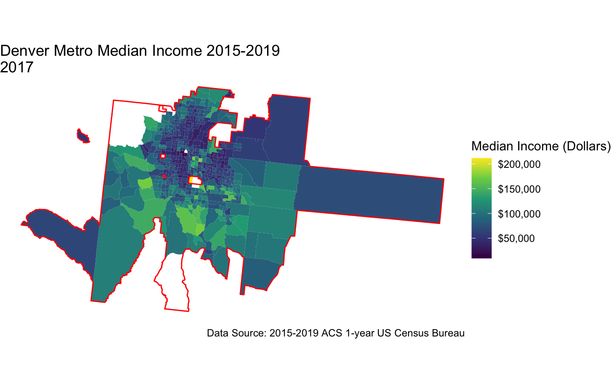

**Project description:** For this project, I wanted to see how Income in the Denver Metro Area changed over time. I used the time period of 2015 to 2019 to observe how income changed for each census tract in the Denver Metro Area. 

